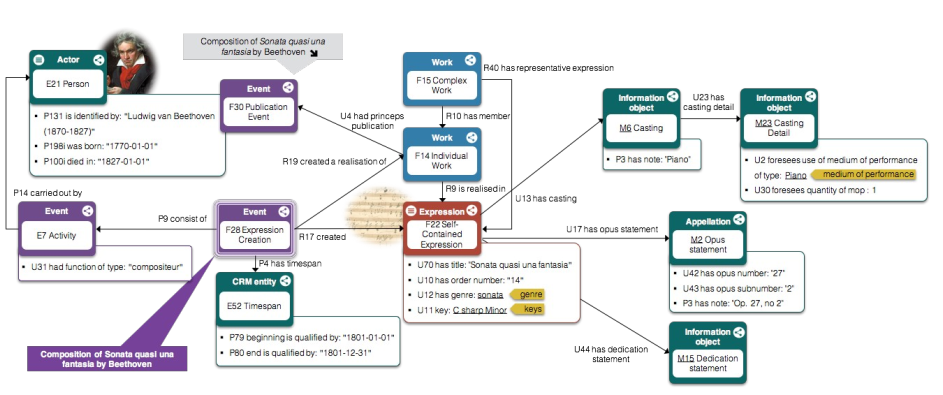
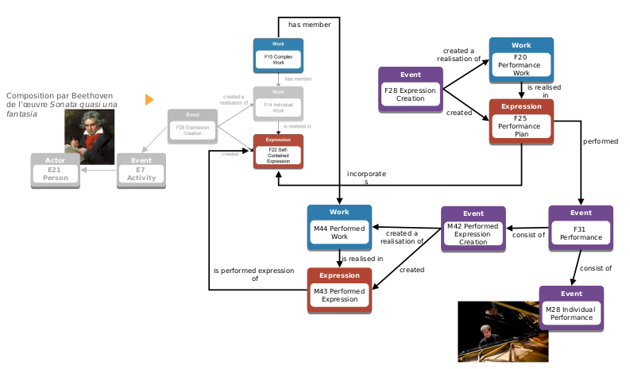
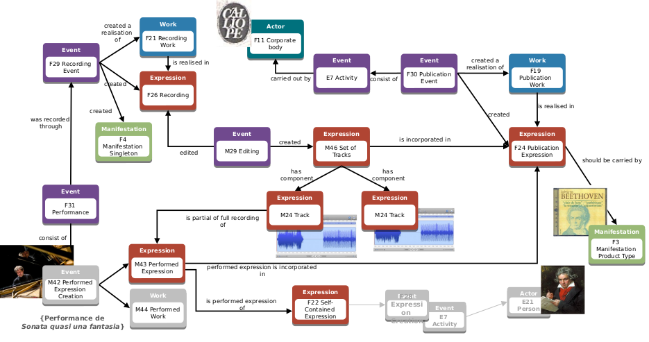
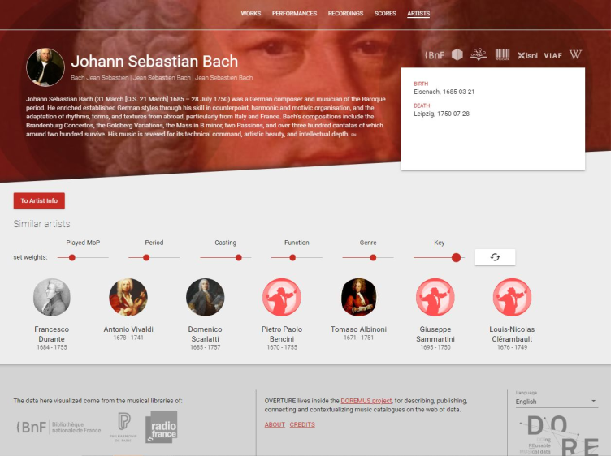

# DOREMUS project

## loujine

## 2018-09-29

## The DOREMUS project

* DOing REusable MUSical data
* French institutions, Nationale Radio (RF), Library (BnF), main Concert Hall
(Philharmonie)
* Goal: create common schema to align independent databases storing concert / discs / works data & publish Open Linked Data

## Scope

* 35 people involved, 4 years, ca. 2M€ budget
* ~ 150.000 works, 90.000 music sheets, 30.000 recordings, 9.500 past and
future concerts, 140.000 artists
* data in standard format for librarians, not adapted to music
* mainly classical music

## Results

* complex model to describe work composition, work performance, work recording
* controlled vocabularies (instruments, genres, tonalities, roles, derived works...) tested on large datasets
* alignment tools

## Work composition

## Work performance

## Work recording

## Output

* github repos [https://github.com/DOREMUS-ANR/](https://github.com/DOREMUS-ANR/)
* Vocabularies [http://data.doremus.org/](http://data.doremus.org/)
* Overture website to expose their data
[http://overture.doremus.org/](http://overture.doremus.org/)

## Recommendation engine prototype

* participated in Spotify Million Playlist contest
* recommendation for composers in Overture

* Google assistant chatbot "Give me works by Mozart with a clarinet"
* Instruments similarity

## Work in common with MusicBrainz

* reo, yvanzo and I had meetings with them earlier this year
* We worked on artist alignment through common identifiers (VIAF), 4000 links
added: [notebook](https://loujine.github.io/musicbrainz-dataviz/24-doremus.html)
* Next steps: aligning works based on composers and catalogues

## What's in there for them?

* make their data available through MB
* import MB data (links)

## What's in there for us?

* Improving our schema (esp. for classical music) with their controlled
vocabularies
* Importing well-structured data (artists, works, recordings, events)

## Open questions

* who's continuing the alignment?
* importing data in MB: bot or community project (userscript-helped volunteers)?
